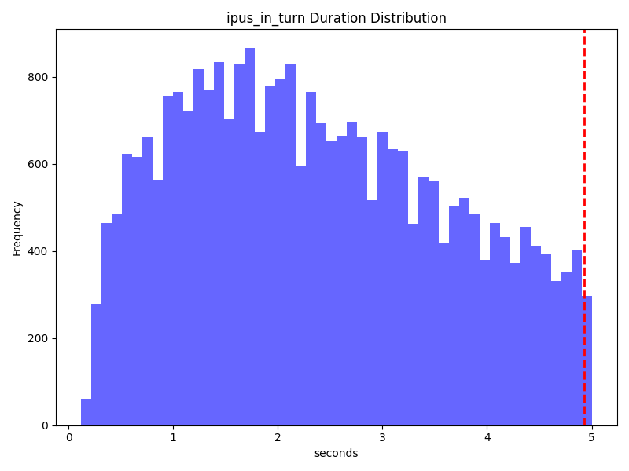
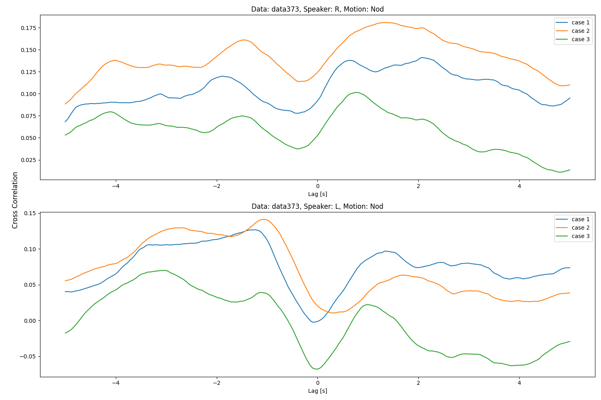
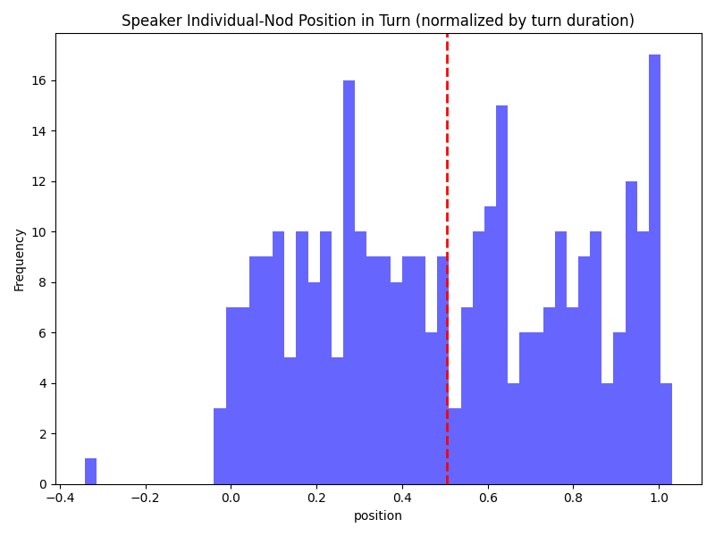
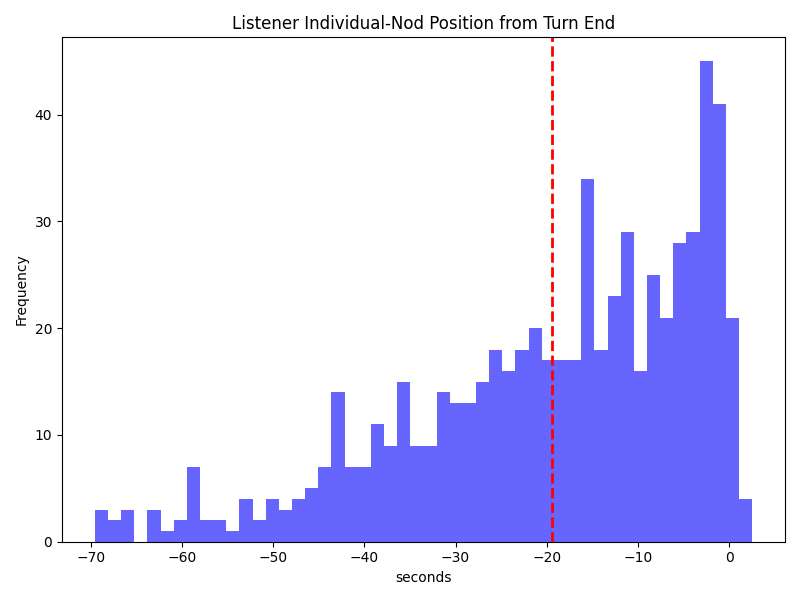
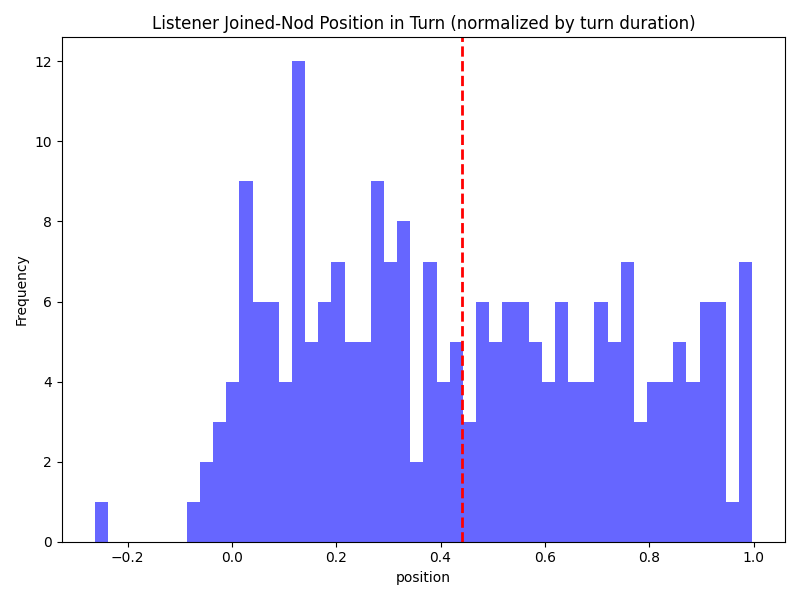
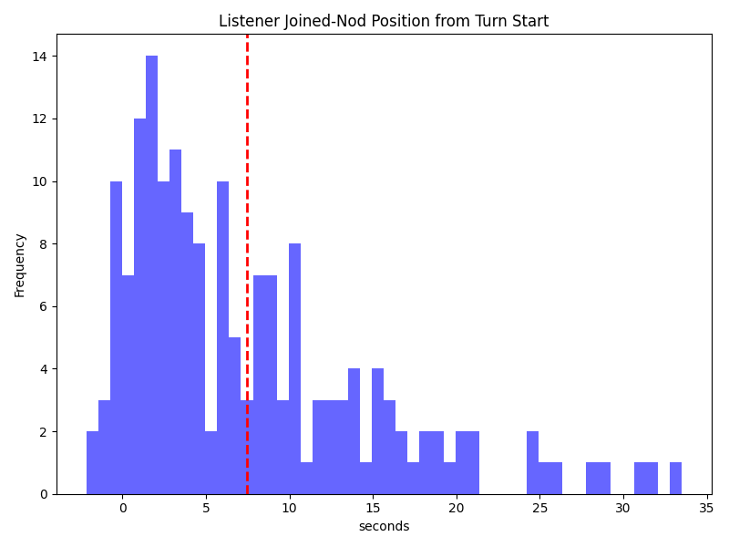

# Dataset's Parameter
 - Session Number：478
 - Total Duration：90 [h]
 - Total Participant：25

# Turntake Analysis

## Turn Duration

Turn の継続時間の平均と標準偏差。
| Mean [s] | std [s] |
| -------: | ------: |
| 9.0514 | 11.8012 |

## Turntake

一つのセッションにおける Turntake の回数の平均と標準偏差。
| Mean [times] | std [times] |
| -----------: | ---------------: |
| 55.3442 | 19.1695 |

Turntake における Interruption と Gap の割合。
| Interruption Ratio [%] | Gap Ratio [%] | Turntake Mean [times] |
| ---------------------: | ------------: | --------------------: |
| 0.2944 | 0.7056 | 55.3442 |

Gap の継続時間の平均と標準偏差。
| Mean [s] | std [s] |
| -------: | -----------: |
| 0.4878 | 2.1220 |

# Inter-Pausal Units (IPUs) Analysis
Pyannote VAD によって抽出された IPU の統計量。
ここでは、turn, gap は VAD 結果から抽出された結果から計算。ただし、VAD 結果からの turn-taking 判定は自動ではなく、アノテーション結果を用いており、あくまで、得られた VAD 結果から最も理想的な (人間の判断に近い) turn-taking 判定を行った場合の結果を示している。

 | Type | Mean [s] | std [s] |
 | ---- | -------: | -----------: |
 | turn | 9.9311 | 12.2060 |
 | ipu | 3.4510 | 4.6957 |
 | pause | 0.8654 | 0.6364 |
 | backchannel | 0.9653 | 0.8544 |
 | gap | -1.1542 | 5.9577 |
 | ipus_in_turn | 4.9293 | 5.3853 |

## Turn Duration Distribution (VAD)

## IPU Duration Distribution

## Pause Duration Distribution

## Backchannel Duration Distribution

## Gap Duration Distribution (VAD)

## IPU (in Turn) Duration Distribution

## Differencese
turn 判定における VAD 結果とアノテーション結果の差異
IPU Analysis における turn と、アノテーション結果の turn の差異を示す。

 | Precision | Recall | Accuracy | F1 |
 | --------: | -----: | -------: | -: |
 | 0.8720 | 0.9463 | 0.9095 | 0.9076 |

# Nod & Backchannel Analysis
2 つのデータ (data007, data373) について、頷きのアノテーションを行い、分析を行った。## 解析対象のデータの素性
### Turntake Analysis

#### Data: data373
##### data373 全体のデータ
###### Turn Duration
data373 における Turn の継続時間の平均と標準偏差。| Mean [s] | std [s] |
| -------: | -----------: |
| 14.0202 | 16.8049 |

###### Turntake

data373 における Turntake の回数：37.97314948224554 [times]

data373 全体における、interruption と gap の割合。
| Interruption Ratio [%] | Gap Ratio [%] | Turntake [times] |
| ---------------------: | ------------: | ---------------: |
| 0.4043 | 0.5957 | 38 |

data373 全体における、交替潜時 (interruption + gap) の平均継続時間と標準偏差。
| Mean [s] | std [s] |
| -------: | ------: |
| -0.2347 | 5.1005 |

##### data373 の動画データの右側の話者のデータ
###### Turn Duration

data373 の右側の話者における Turn の継続時間の平均と標準偏差。| Mean [s] | std [s] |
| -------: | -----------: |
| 18.3557 | 19.0033 |

###### Turntake

data373 の右側の話者における、interruption と gap の割合。
| Interruption Ratio [%] | Gap Ratio [%] | Get Turn [times] |
| ---------------------: | ------------: | ---------------: |
| 0.2174 | 0.7826 | 23 |

data373 の右側の話者における、交替潜時 (interruption + gap) の平均継続時間と標準偏差。
| Mean [s] | std [s] |
| -------: | ------: |
| -0.6076 | 7.1686 |

##### data373 の動画データの左側の話者のデータ
###### Turn Duration
data373 の左側の話者における Turn の継続時間の平均と標準偏差。
| Mean [s] | std [s] |
| -------: | -----------: |
| 9.1427 | 12.2029 |

###### Turntake

data373 の左側の話者における、interruption と gap の割合。
| Interruption Ratio [%] | Gap Ratio [%] | Get Turn [times] |
| ---------------------: | ------------: | ---------------: |
| 0.5833 | 0.4167 | 24 |

data373 の左側の話者における、交替潜時 (interruption + gap) の平均継続時間と標準偏差。
| Mean [s] | std [s] |
| -------: | ------: |
| 0.1227 | 1.1991 |

#### Data: data007
##### data007 全体のデータ
###### Turn Duration
data007 における Turn の継続時間の平均と標準偏差。
| Mean [s] | std [s] |
| -------: | -----------: |
| 9.9371 | 8.7928 |

###### Turntake

data007 における Turntake の回数：50.11282712539929 [times]

data007 全体における、interruption と gap の割合。
| Interruption Ratio [%] | Gap Ratio [%] | Turntake [times] |
| ---------------------: | ------------: | ---------------: |
| 0.2105 | 0.7895 | 50 |

data007 全体における、交替潜時 (interruption + gap) の平均継続時間と標準偏差。
| Mean [s] | std [s] |
| -------: | ------: |
| 0.9439 | 1.4129 |

##### data007 の動画データの右側の話者のデータ
###### Turn Duration

data007 の右側の話者における Turn の継続時間の平均と標準偏差。
| Mean [s] | std [s] |
| -------: | -----------: |
| 10.3728 | 7.6744 |

###### Turntake

data007 の右側の話者における、interruption と gap の割合。
| Interruption Ratio [%] | Gap Ratio [%] | Get Turn [times] |
| ---------------------: | ------------: | ---------------: |
| 0.1379 | 0.8621 | 29 |

data007 の右側の話者における、交替潜時 (interruption + gap) の平均継続時間と標準偏差。
| Mean [s] | std [s] |
| -------: | ------: |
| 1.2233 | 1.3790 |

##### data007 の動画データの左側の話者のデータ
###### Turn Duration
data007 の左側の話者における Turn の継続時間の平均と標準偏差。
| Mean [s] | std [s] |
| -------: | -----------: |
| 9.5286 | 9.7073 |

###### Turntake

data007 の左側の話者における、interruption と gap の割合。
| Interruption Ratio [%] | Gap Ratio [%] | Get Turn [times] |
| ---------------------: | ------------: | ---------------: |
| 0.2857 | 0.7143 | 28 |

data007 の左側の話者における、交替潜時 (interruption + gap) の平均継続時間と標準偏差。
| Mean [s] | std [s] |
| -------: | ------: |
| 0.6545 | 1.3892 |

### IPUs Analysis

#### Data: data373
 | Type | Mean [s] | std [s] |
 | ---- | -------: | -----------: |
| turn | 14.3383 | 16.5837 |
| ipu | 3.0896 | 3.5188 |
| pause | 1.0212 | 0.6189 |
| backchannel | 0.9660 | 0.8038 |
| gap | -1.7892 | 8.7860 |
| ipus_in_turn | 4.5453 | 3.8946 |

#### Data: data007
| Type | Mean [s] | std [s] |
| ---- | -------: | -----------: |
| turn | 10.7977 | 9.0101 |
| ipu | 3.0616 | 2.9138 |
| pause | 1.0511 | 0.7073 |
| backchannel | 1.1440 | 0.6316 |
| gap | -0.1634 | 1.5980 |
| ipus_in_turn | 4.0270 | 3.1273 |

## Nod & Backchannel Corelation Analysis

### Cross Correlation Analysis (Listener-Nod & Listener-Backchannel)
聞き手の頷きと相槌の時間的な相互相関の解析を行った。
相互相関の算出時には、頭部動作に lag を付与して計算した。
相互相関の解析においては、次の３つのパターンで計算を行った。
case 1. 頭部動作と backchannel のアノテーション結果と検出結果を特に修正しない。
case 2. 頭部動作の継続時間を、開始から1.0秒に揃える。
case 3. 頭部動作と backchannel の継続時間をそれぞれ、開始から1.0秒、1.0秒に揃える。
case 4. 連続する頭部動作を一つの頭部動作として扱い、他の条件は case 3 と同様。

#### Data: data373
話し手が発話を行っている間に発生した聞き手の頷きと相槌の相互相関

話し手が発話を行っていない間に発生した聞き手の頷きと相槌の相互相関

全ての backchannel に対する聞き手の頷きと相槌の相互相関

#### Data: data007
話し手が発話を行っている間に発生した聞き手の頷きと相槌の相互相関

話し手が発話を行っていない間に発生した聞き手の頷きと相槌の相互相関

全ての backchannel に対する聞き手の頷きと相槌の相互相関

### Cooccurrence Analysis (Listener-Nod & Listener-Backchannel)
##### Data: data373
`BC pos` は `in` が対話相手の turn 内で発生したもの、`out` が対話相手の turn 外で発生したもの、`all` がすべての backchannel を示す。
`Ratio BC` は、backchannel と共起する頷きの割合を示す。
`Ratio Nod` は、頷きと共起する backchannel の割合を示す。

連続的に発生する頷きをそれぞれ別個の頷きとして扱った場合
| Speaker | BC pos | Ratio BC (total time) | Ratio Nod (total time) |
| ------: | -----: | --------------------: | ---------------------: |
| R | in | 0.7000 (20) | 0.0317 (442) |
| R | out | 0.0500 (20) | 0.0023 (442) |
| R | all | 0.7500 (20) | 0.0339 (442) |
| L | in | 0.9000 (80) | 0.1338 (538) |
| L | out | 0.0000 (80) | 0.0000 (538) |
| L | all | 0.9000 (80) | 0.1338 (538) |

連続的に発生する一連の頷きを一つの頷きとして扱った場合
| Speaker | BC pos | Ratio BC (total time) | Ratio Nod (total time) |
| ------: | -----: | --------------------: | ---------------------: |
| R | in | 0.7000 (20) | 0.0654 (214) |
| R | out | 0.0500 (20) | 0.0047 (214) |
| R | all | 0.7500 (20) | 0.0701 (214) |
| L | in | 0.8875 (80) | 0.3100 (229) |
| L | out | 0.0000 (80) | 0.0000 (229) |
| L | all | 0.8875 (80) | 0.3100 (229) |

##### Data: data007
`BC pos` は `in` が対話相手の turn 内で発生したもの、`out` が対話相手の turn 外で発生したもの、`all` がすべての backchannel を示す。
`Ratio BC` は、backchannel と共起する頷きの割合を示す。
`Ratio Nod` は、頷きと共起する backchannel の割合を示す。

連続的に発生する頷きをそれぞれ別個の頷きとして扱った場合
| Speaker | BC pos | Ratio BC (total time) | Ratio Nod (total time) |
| ------: | -----: | --------------------: | ---------------------: |
| R | in | 0.4000 (30) | 0.0386 (311) |
| R | out | 0.0667 (30) | 0.0064 (311) |
| R | all | 0.4667 (30) | 0.0450 (311) |
| L | in | 0.6364 (44) | 0.0795 (352) |
| L | out | 0.0455 (44) | 0.0057 (352) |
| L | all | 0.6818 (44) | 0.0852 (352) |

連続的に発生する一連の頷きを一つの頷きとして扱った場合
| Speaker | BC pos | Ratio BC (total time) | Ratio Nod (total time) |
| ------: | -----: | --------------------: | ---------------------: |
| R | in | 0.4000 (30) | 0.0822 (146) |
| R | out | 0.0667 (30) | 0.0137 (146) |
| R | all | 0.4667 (30) | 0.0959 (146) |
| L | in | 0.5455 (44) | 0.1633 (147) |
| L | out | 0.0455 (44) | 0.0136 (147) |
| L | all | 0.5909 (44) | 0.1769 (147) |

### Cross Correlation Analysis (Listener-Head & Speaker-IPUs)
各データの`cross-corelation_nod-ipu`のグラフを参照。
聞き手の頭部動作と話し手の発話区間における VAD 結果との相関係数を計算した。
相互相関の算出時には、頭部動作に lag を付与して計算した。
相互相関の解析においては、次の２つのパターンで計算を行った。
case 1. 頭部動作と VAD の、アノテーション結果と検出結果を特に修正しない。
case 2. 頭部動作の継続時間を、開始から1.0秒に揃える。
case 3. 連続する頭部動作を一つの頭部動作とし手扱い、開始から1.0秒に揃える。

話し手の発話区間における VAD 結果と聞き手の頷きの相互相関

話し手の発話区間における VAD 結果と聞き手の頷きの相互相関

### 発話の頷き位置の解析
各データの`speaker-***-nod-pos`のグラフを参照。
Joined は連続する頷きを一つの頷きとして扱い、Individual は連続する頷きを別々の頷きとして扱った。
話し手の頷きと Turn の開始・終了時刻の関係を検証し分布をグラフにプロットした。
case 1. 話し手の頷きのタイミングを Turn の開始時刻からの相対時間で示した。
case 2. 話し手の頷きのタイミングを Turn の終了時刻からの相対時間で示した。
case 3. 話し手の頷きのタイミングを Turn の時間に対して正規化した。

#### Data: data373
Turn の開始時刻からの相対時間で示した話し手の頷き (Joined) のタイミング

Turn の開始時刻からの相対時間で示した話し手の頷き (Individual) のタイミング

Turn の終了時刻からの相対時間で示した話し手の頷き (Joined) のタイミング

Turn の終了時刻からの相対時間で示した話し手の頷き (Individual) のタイミング

Turn の継続時間に対して正規化した話し手の頷き (Joined) のタイミング

Turn の継続時間に対して正規化した話し手の頷き (Individual) のタイミング

#### Data: data007
Turn の開始時刻からの相対時間で示した話し手の頷き (Joined) のタイミング

Turn の開始時刻からの相対時間で示した話し手の頷き (Individual) のタイミング

Turn の終了時刻からの相対時間で示した話し手の頷き (Joined) のタイミング

Turn の終了時刻からの相対時間で示した話し手の頷き (Individual) のタイミング

Turn の継続時間に対して正規化した話し手の頷き (Joined) のタイミング

Turn の継続時間に対して正規化した話し手の頷き (Individual) のタイミング

### 傾聴時の頷き位置の解析
各データの`listener-***-nod-pos`のグラフを参照。
Joined は連続する頷きを一つの頷きとして扱い、Individual は連続する頷きを別々の頷きとして扱った。
聞き手の頷きと Turn の開始・終了時刻の関係を検証した。
case 1. 聞き手の頷きのタイミングを Turn の開始時刻からの相対時間で示した。
case 2. 聞き手の頷きのタイミングを Turn の終了時刻からの相対時間で示した。
case 3. 聞き手の頷きのタイミングを Turn の時間に対して正規化した。

#### Data: data373
Turn の開始時刻からの相対時間で示した聞き手の頷き (Joined) のタイミング

Turn の開始時刻からの相対時間で示した聞き手の頷き (Individual) のタイミング

Turn の終了時刻からの相対時間で示した聞き手の頷き (Joined) のタイミング

Turn の終了時刻からの相対時間で示した聞き手の頷き (Individual) のタイミング

Turn の継続時間に対して正規化した聞き手の頷き (Joined) のタイミング

Turn の継続時間に対して正規化した聞き手の頷き (Individual) のタイミング

#### Data: data007
Turn の開始時刻からの相対時間で示した聞き手の頷き (Joined) のタイミング

Turn の開始時刻からの相対時間で示した聞き手の頷き (Individual) のタイミング

Turn の終了時刻からの相対時間で示した聞き手の頷き (Joined) のタイミング

Turn の終了時刻からの相対時間で示した聞き手の頷き (Individual) のタイミング

Turn の継続時間に対して正規化した聞き手の頷き (Joined) のタイミング

Turn の継続時間に対して正規化した聞き手の頷き (Individual) のタイミング

